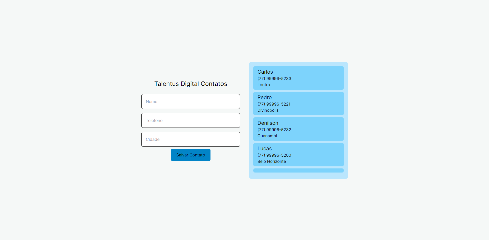

<h1 align="center">Desafio Talentus Digital</h1>



## 📖 Sobre

Trata-se de o desenvolvimento de 2 telas funcionais.

A tela 1, tem um login, que não está funcional com o Firebase Authentication.<br>
A tela 2, tem um cadastro de contatos, com os dados armazenados no Firestore.

## 🔧 Como executar o projeto

Clone o projeto e acesse a pasta

```bash
$ git clone git@github.com:DenilsonMelo/challenge-fs-td.git && cd challenge-fs-td
```

O projeto pode ser executado localmente, para isso é necessário rodar o comando.

Na raiz do projeto, execute:
```bash
   yarn dev
   ```

O front-end estará rodando no endereço http://localhost:3000.<br>

## 📃 Descrição do Projeto:
A aplicação desenvolvida tem a seguinte estrutura:

   - Página inicial: traz uma lista com todas as todos, é possivel adicionar uma nova todo, visualizar em um modal uma todo especifica e remover um todo.
   - Ao clicar no botão "Nova tarefa" no Header da aplicação um modal será aberto para a inserção de uma nova todo.
## 🖥️ Tecnologias usadas
   - NextJS
   - React.js 
   - TailwindCSS
   - Firebase / Firestore
